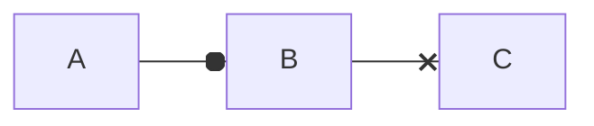
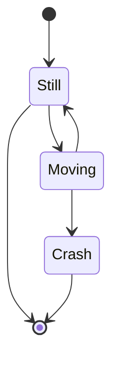

# Título da página


## Listas

### Não ordenadas

- X
- Y
- Z

### Ordenadas

1. Primeiro
2. Segundo
3. Terceiro

## Alterações de texto

**Negrito**

*italico*

`segredo = 42`

Emoji - :snake: :heart: :rocket: 

~~Tachado~~

==Realçado==

## Citações

Alguém disse

> Essa é uma citação

## Link

[DuckDuckGo](http://ddg.gg)

## Tabela

| Nome | Idade |
| ---- | ----- |
| DJ | 100 |
| Python  | 1040 |

## Lista de tarefas

- [ ] Criar as tarefas
- [ ] Analisar as tarefas
- [x] Finalizar as tarefas

## Bloco de código

```{.py3 hl_lines="1-3" linenums="55" title="meu_arquivo.py"}
def xpto():
   """Docstring."""
   return True
```

## Custom fences






